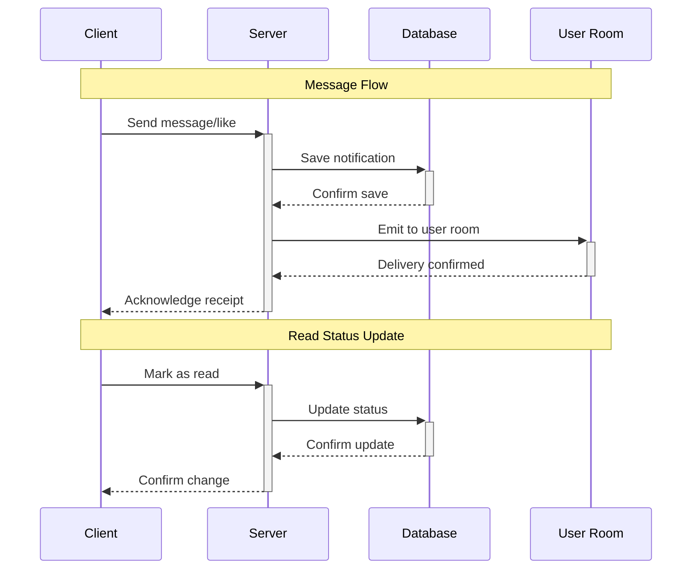
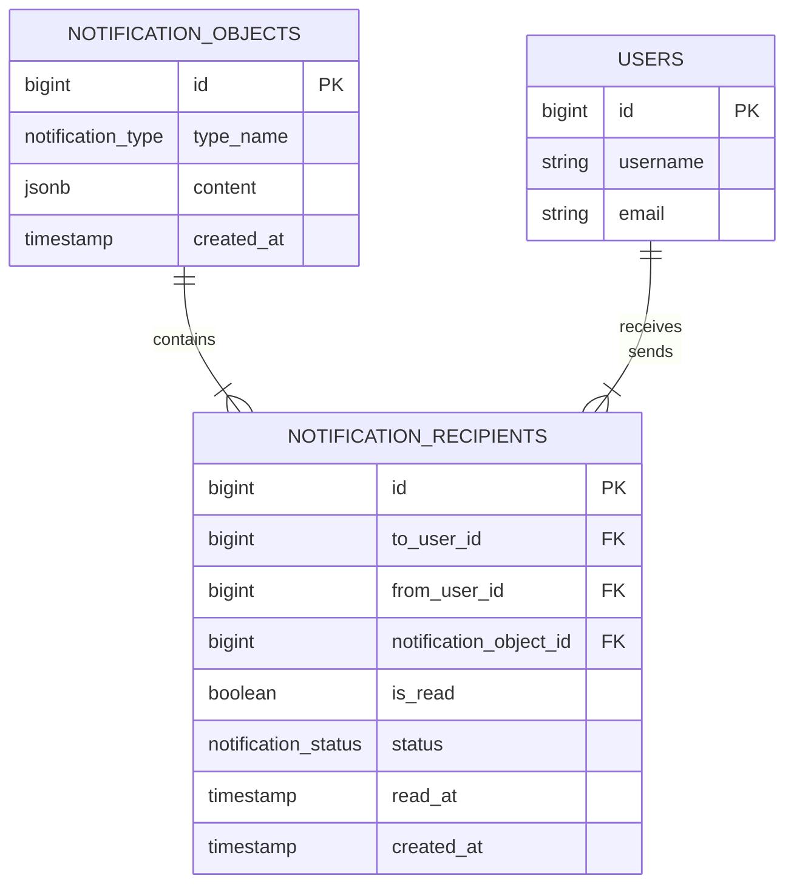
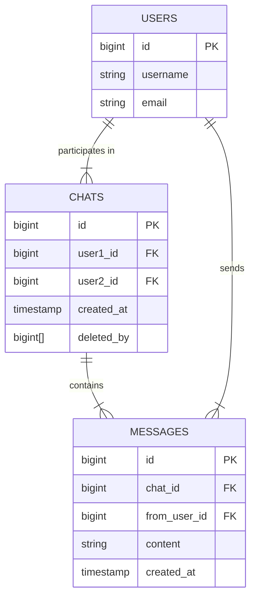
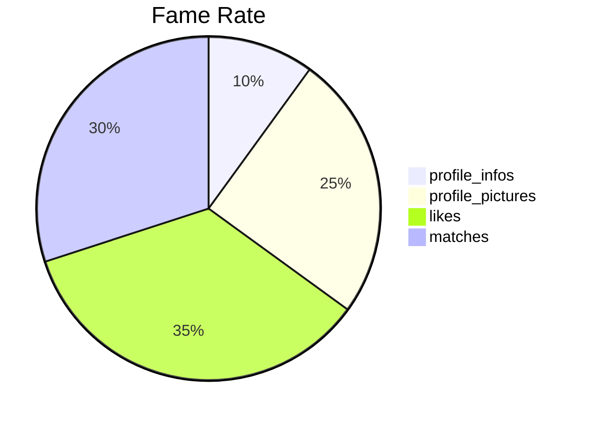

# 42-matcha

A dating website that allows users to register, log in, complete their profile, search and view the profiles of other users, and show interest in them with a “like”, chat with those that “liked” back.

```mermaid
---
config:
  curve: basis
  htmlLabels: true
---
flowchart
  direction TB
  classDef black fill:#000,stroke:#333,stroke-width:1px;
  classDef white fill:#fff,color:#555,stroke:#333,stroke-width:1px;
  classDef white_border fill:#fff,color:#000,stroke:#333,stroke-width:1px, stroke-dasharray: 5, 5;
  classDef green fill:#0f0,color:#555,stroke:#333,stroke-width:1px;
  classDef lightblue fill:#99f,color:#fff,stroke:#333,stroke-width:1px;
  classDef lightgreen fill:#9f9,color:#555,stroke:#333,stroke-width:1px;
  classDef lightred fill:#f99,color:#555,stroke:#333,stroke-width:1px;
  classDef lightyellow fill:#ff9,color:#555,stroke:#333,stroke-width:1px;
  classDef lightorange fill:#f90,color:#555,stroke:#333,stroke-width:1px;
  classDef lightpurple fill:#f0f,color:#555,stroke:#333,stroke-width:1px;
  classDef lightcyan fill:#9ff,color:#555,stroke:#333,stroke-width:1px;
  classDef lightpink fill:#f9f,color:#555,stroke:#333,stroke-width:1px;
  classDef lightbrown fill:#963,color:#555,stroke:#333,stroke-width:1px;
  classDef lightgrey fill:#999,color:#555,stroke:#333,stroke-width:1px;
  classDef lightblack fill:#000,stroke:#333,stroke-width:1px;
  classDef lightwhite fill:#fff,color:#555,stroke:#333,stroke-width:1px;

  Project:::white_border
  subgraph Project
    direction TB
    WorldWideWeb <-->|"`*80<br>(443)*`"| Nginx
    WorldWideWeb((fa:fa-globe World Wide<br>Web)):::lightgreen
    Browser <-->|"`*80<br>(443)*`"| WorldWideWeb

    subgraph Client_Host["fas:fa-laptop-code Client Host"]
      Browser:::lightcyan

      subgraph Browser["fas:fa-globe Browser"]
        React_App("fab:fa-react ReactJS<br>App")
      end

    end

    subgraph Server_Host["fas:fa-computer Server Host"]
      Docker_Network:::lightblue

      subgraph Docker_Network["fas:fa-network-wired Docker Network"]
        Postgres("fa:fa-database Postgres<br>Container")
        Nginx("fa:fa-server Nginx<br>Container")
        Express_Server("fab:fa-node Express<br>Container")
        React_Build("fab:fa-react ReactJS<br>Builder")
      end
      Nginx <-.->|"`*/api/<br>8000*`"| Express_Server
      Nginx <-.->|"`*/socket.io/<br>8000*`"| Express_Server
      Express_Server <-.->|"`*5432*`"| Postgres

    Volume_Postgres[("fas:fa-hdd Postgres<br>Volume")]:::lightorange
    Postgres <-.-> Volume_Postgres
    Volume_Client_Build[("fas:fa-hdd Client Build<br>Volume")]:::lightorange
    React_Build -.-> Volume_Client_Build
    Nginx -->|"static files"| Volume_Client_Build
    end
  end

  linkStyle 0,1 stroke:lightgreen,stroke-width:4px;
  linkStyle 2,3,4 stroke:lightblue,stroke-width:2px;

```

<link rel="stylesheet" href="https://cdnjs.cloudflare.com/ajax/libs/font-awesome/6.4.0/css/all.min.css">



## Demo

- Homepage: http://localhost

- API: http://localhost/api

## Installation

### Prerequisites

- [Docker](https://docs.docker.com/get-docker/)
- [Docker Compose](https://docs.docker.com/compose/install/)
- [Git](https://git-scm.com/downloads)
- [Node.js](https://nodejs.org/en/download/) (optional, for development)

### Steps

#### Clone the repository

```bash
# Clone the repository
git clone git@github.com:Tablerase/42_Matcha.git
cd 42_Matcha
```

#### Environment Variables

Add the `.env` file in the root directory of the project.

```bash
.
├── client
├── docker-compose.yml
├── .env
├── .git
├── .gitignore
├── matcha.sh
├── nginx.conf
├── README.md
├── server
└── .vscode
```

```bash
# Here is an example of the .env file
echo "
# Database

POSTGRES_USER=matcha
POSTGRES_PASSWORD=matcha
POSTGRES_DB=matcha
POSTGRES_HOST=database
DB_PORT=5432

# Client

FRONTEND_URL=http://localhost

# Server

SOCKET_URL=http://localhost/
API_URL=http://localhost/api
SERVER_PORT=8000
# NODE_ENV=development
NODE_ENV=production
TZ=UTC

# JWT

JWT_SECRET_KEY=secret
ACCESS_TOKEN_EXPIRES_IN=1d
REFRESH_TOKEN_EXPIRES_IN=7d

SMTP_HOST=smtp.gmail.com
SMTP_PORT=587
SMTP_SECURE=false
SMTP_USER=your-email-address
SMTP_PASS=your-app-password
"> .env
```

#### Script launch

```bash
./matcha.sh
```

#### Manual launch

```bash
# Launch the Docker containers in detached mode
docker compose up -d
```

or

```bash
# Launch the Docker containers in attached mode
docker compose up
```

## Commands

### Nginx

```bash
# Reload Nginx
docker compose exec nginx nginx -s reload
```

### Docker

```bash
# Build the Docker containers
docker compose build
```

```bash
# Start the Docker containers
docker compose up -d
```

```bash
# Stop the Docker containers
docker compose down
```

```bash
# Stop and remove all containers
docker stop $(docker ps -aq)
docker rm $(docker ps -aq)
```

```bash
# Remove all images
docker rmi $(docker images -q)
```

```bash
# Remove all volumes
docker volume rm $(docker volume ls -q)
```

## Users Generation

### Random User API

The Random User API is a free API that allows you to generate random user data. It is a RESTful API that responds with JSON data.

```http
https://randomuser.me/api/
```

#### Parameters

[API Documentation - How to use](https://randomuser.me/documentation#howto)

<!-- ## Design

Browse profiles/users with tea bags opening and closing, and a cup of tea that fills up as you scroll down the page.

## User Interface

- MUI (Material-UI)
  - [MUI Documentation](https://material-ui.com/getting-started/installation/)
  - [MUI Icons](https://material-ui.com/components/material-icons/)
  - [MUI Slider](https://mui.com/material-ui/react-slider/)
  - [MUI Grid](https://mui.com/material-ui/react-grid2/)

## Location

- [Geolocation API](https://developer.mozilla.org/en-US/docs/Web/API/Geolocation_API)

### Map

- [React Leaflet](https://react-leaflet.js.org/) -->

## Notifications

### Diagrams

#### Diagram Notif/Chat Flow



#### Diagram Database



### Socket notif

- https://medium.com/@hirenchavda141/from-scratch-to-real-time-building-a-notification-system-with-node-js-typescript-and-socket-io-2aa869dece40

### UI notif

- https://notistack.com/features/customization#custom-variant-(typescript)

### Database notif (scalable - not used)

- https://tannguyenit95.medium.com/designing-a-notification-system-1da83ca971bc

## Chat

- https://dev.to/novu/building-a-chat-app-with-socketio-and-react-2edj
- https://socket.io/get-started/private-messaging-part-1/

### Diagram Database



## Fame Rate



- Profile Infos: max 10 Fame Points
  - 1 Fame Point per field
- Profile Pictures: max 25 Fame Points
  - 5 Fame Points per picture
- Likes: max 35 Fame Points
  - 1 Fame Point per like
- Matches: max 30 Fame Points
  - 2 Fame Points per match

## Resources

### React

https://react.dev/learn/typescript#typescript-with-react-components
https://tigerabrodi.blog/become-expert-in-react-query?ref=dailydev

### Sockets

- [Socket.io Documentation](https://socket.io/docs/v4/)
- [Socket.io - Middleware](https://socket.io/docs/v4/middlewares/)
- [Socket.io - Emit cheatsheet](https://socket.io/docs/v4/emit-cheatsheet/)
- [Socket.io with React](https://dev.to/bravemaster619/how-to-use-socket-io-client-correctly-in-react-app-o65)
  - [Emitting events](https://socket.io/docs/v4/emitting-events/)

### Images

- [OpenLicence Image Sharing - Unsplash](https://unsplash.com/)
- [Unsplash - teacup filled with matcha tea](https://unsplash.com/photos/white-ceramic-teacup-filled-of-matcha-tea-Z-hvocTfR_s)

### Patterns

- [Kind Panther by Marcelo Dolza](https://uiverse.io/marcelodolza/kind-panther-75)

### Favicon

- [Tea Cup by Solar Icons](https://www.svgrepo.com/svg/527916/tea-cup)
- [Matcha Tea mug Icon by Freepik](https://www.flaticon.com/free-icons/tea-mug)

### Loading

- [Codepen - Tea cup loading by oviedofer97](https://codepen.io/oviedofer97/pen/dyNzQeX)
