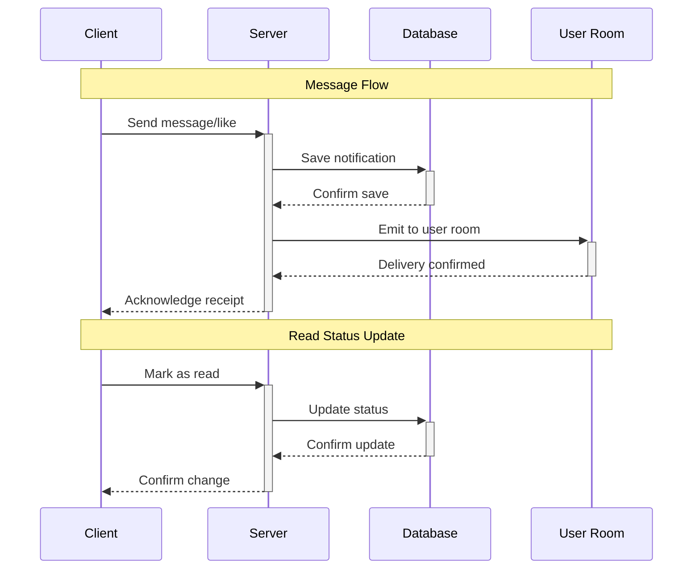

# 42-matcha

A dating website that allows users to register, log in, complete their profile, search and view the profiles of other users, and show interest in them with a “like” , chat with those that “liked” back.

## Users Generation

### Random User API

The Random User API is a free API that allows you to generate random user data. It is a RESTful API that responds with JSON data.

#### Base URL

```http
https://randomuser.me/api/
```

#### Parameters

[API Documentation - How to use](https://randomuser.me/documentation#howto)

## Design

Browse profiles/users with tea bags opening and closing, and a cup of tea that fills up as you scroll down the page.

## User Interface

- MUI (Material-UI)
  - [MUI Documentation](https://material-ui.com/getting-started/installation/)
  - [MUI Icons](https://material-ui.com/components/material-icons/)
  - [MUI Slider](https://mui.com/material-ui/react-slider/)
  - [MUI Grid](https://mui.com/material-ui/react-grid2/)

## Location

- [Geolocation API](https://developer.mozilla.org/en-US/docs/Web/API/Geolocation_API)

### Map

- [React Leaflet](https://react-leaflet.js.org/)

## Notifications

### Diagrams

#### Diagram Notif Flow



#### Diagram Database

```mermaid
erDiagram
    NOTIFICATION_OBJECTS ||-    NOTIFICATION_RECIPIENTS { contains
    USERS ||-    NOTIFICATION_RECIPIENTS { "receives<br />sends"

    NOTIFICATION_OBJECTS {
        bigint id PK
        notification_type type_name
        jsonb content
        timestamp created_at
    }

    NOTIFICATION_RECIPIENTS {
        bigint id PK
        bigint to_user_id FK
        bigint from_user_id FK
        bigint notification_object_id FK
        boolean is_read
        notification_status status
        timestamp read_at
        timestamp created_at
    }

    USERS {
        bigint id PK
        string username
        string email
    }
```

### Socket notif

- https://medium.com/@hirenchavda141/from-scratch-to-real-time-building-a-notification-system-with-node-js-typescript-and-socket-io-2aa869dece40

### UI notif

- https://notistack.com/features/customization#custom-variant-(typescript)

### Database notif (scalable - not used)

- https://tannguyenit95.medium.com/designing-a-notification-system-1da83ca971bc

## Resources

### Sockets

- [Socket.io Documentation](https://socket.io/docs/v4/)
- [Socket.io - Middleware](https://socket.io/docs/v4/middlewares/)

### Images

- [OpenLicence Image Sharing - Unsplash](https://unsplash.com/)
- [Unsplash - teacup filled with matcha tea](https://unsplash.com/photos/white-ceramic-teacup-filled-of-matcha-tea-Z-hvocTfR_s)

### Favicon

- [Tea Cup by Solar Icons](https://www.svgrepo.com/svg/527916/tea-cup)
- [Matcha Tea mug Icon by Freepik - SVG not free](https://www.flaticon.com/free-icons/tea-mug)

### Loading

- [Codepen - Tea cup loading by oviedofer97](https://codepen.io/oviedofer97/pen/dyNzQeX)
